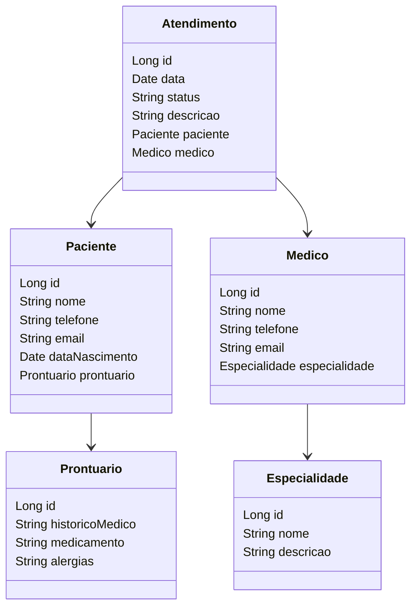

# Projeto Agendamento Médico

Desenvolvendo uma API RestFull CRUD para realizar agendamentos médicos utilizando Spring Boot.

## 🚀 Tecnologias Utilizadas
- MySQL 
- JPA 
- JDBC 
- Spring Web 

## 🖼️ Diagrama mermaid 



## ⚙️ Etapas para Configuração

### 1. Clonar a Aplicação

```bash
git clone https://github.com/DanyelZini
```

### 2. Configurar o Banco de Dados

Certifique-se de que você tem um banco de dados MySQL em execução e configure as credenciais no arquivo `application.properties`.

### 3. Iniciar a Aplicação

```bash
.\mvnw spring-boot:run
```

A aplicação será iniciada na porta http://localhost:8080

## 📖 Explorando as APIs Rest

### Endpoints Disponíveis

#### Atendimento

| Método | URL | Descrição | Corpo Válido |
| ------ | --- | --------- | ------------ |
| GET | /atendimento | Retorna todos os atendimentos | |
| GET | /atendimento/{id} | Retorna um atendimento específico por ID | |
| POST | /atendimento | Cria um novo atendimento | JSON |
| PUT | /atendimento/{id} | Atualiza um atendimento existente | JSON |
| DELETE | /atendimento/{id} | Deleta um atendimento por ID | |

### Exemplo de JSON para Criar um Atendimento

```json
{
  "data": "2023-10-10",
  "status": "Scheduled",
  "descricao": "Consulta de rotina",
  "paciente": {
    "nome": "João Silva",
    "telefone": "123456789",
    "email": "joao.silva@example.com",
    "dataNascimento": "1980-05-15",
    "prontuario": {
      "historico": "Histórico médico do paciente",
      "medicamento": "Medicamento em uso",
      "alergias": "Alergias conhecidas"
    }
  },
  "medico": {
    "nome": "Dra. Maria Oliveira",
    "telefone": "987654321",
    "email": "maria.oliveira@example.com",
    "especialidade": {
      "nome": "Cardiologia",
      "descricao": "Especialista em doenças do coração"
    }
  }
}
```

### ⚠️ Tratamento de Exceções

A aplicação possui um tratamento global de exceções que retorna respostas apropriadas para diferentes tipos de erros.

- **400 Bad Request**: Para erros de validação.
- **404 Not Found**: Quando um recurso não é encontrado.
- **500 Internal Server Error**: Para erros inesperados no servidor.
